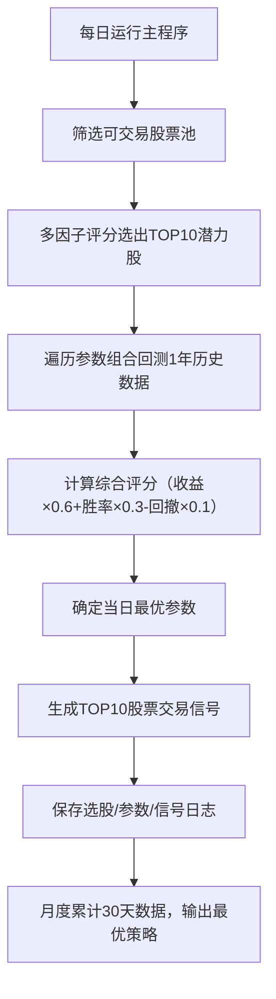

以下是可直接下载的 **README文档内容**（Markdown格式，兼容Word/记事本/浏览器，复制后保存为 `README.md` 即可下载使用，也可直接导入Word）：

```markdown
# A股短线自动选股与策略优化系统

## 项目介绍
本项目是一款专注于A股短线交易的智能化工具，核心实现 **自动筛选10只高潜力短线股 + 月级策略参数自动优化**，无需手动调整参数，每天运行即可持续迭代最优策略，兼顾流动性、收益性与风险控制，适用于追求短线稳健收益的投资者。

## 核心功能
1. **自动选股**：从沪深A股中筛选10只短线潜力股（市值≥500亿、日均成交额≥1亿，排除ST/退市股）；
2. **多因子评分**：基于股价强势度、资金关注度、趋势完整性、流动性等5大因子加权评分，避免单一指标偏差；
3. **策略自动优化**：遍历参数组合（短期均线、长期均线等5类参数），通过1年历史数据回测，每日迭代最优参数；
4. **历史回测验证**：模拟实盘交易（含0.15%交易成本），计算年化收益率、胜率、最大回撤，量化策略表现；
5. **日志追溯**：自动保存每日选股结果、参数优化记录、交易信号，支持月度复盘与策略迭代；
6. **风险控制**：过滤低流动性、高风险股票，交易区间强制限制在涨跌停范围内。

## 代码逻辑解析
### 1. 核心文件结构
| 文件名称                | 核心作用                                                                 |
|-------------------------|--------------------------------------------------------------------------|
| `auto_strategy_optimizer.py` | 主程序：串联选股、参数优化、信号生成全流程，是日常运行的入口文件           |
| `config.py`             | 基础配置：存储策略初始参数、市场信息，供单只股票分析（`main.py`调用）     |
| `trading_signal.py`     | 信号生成：获取股票数据、计算均线/支撑阻力/涨跌停，输出买入/观望信号       |
| `executor.py`           | 建议输出：格式化核心交易建议（股票代码、买入/卖出区间）                   |
| `explainer.py`          | 报告生成：生成策略分析报告，说明信号逻辑与迭代方向                       |
| `main.py`               | 单股分析入口：基于`config.py`配置，单独分析某只股票（如美的集团）         |
| `requirements.txt`      | 依赖清单：明确项目所需Python包及版本，确保环境兼容                       |

### 2. 核心流程逻辑


### 3. 关键模块详解
#### （1）自动选股模块（`auto_strategy_optimizer.py`）
- 筛选逻辑：市值≥500亿（流动性）、日均成交额≥1亿（可交易性）、排除ST/退市股（风险控制）；
- 评分因子：近5日涨幅（30%权重）、成交量放大率（20%）、均线多头排列（20%）、RSI指标（15%）、换手率（15%）；
- 输出：10只高分股票，自动保存至`strategy_log/stock_selection_log.csv`。

#### （2）参数优化模块（`auto_strategy_optimizer.py`）
- 优化参数：短期均线（3-10天）、长期均线（15-30天）、支撑阻力计算天数（3-7天）、买入区间margin（0.005-0.02）、卖出区间margin（0.005-0.02）；
- 回测逻辑：金叉买入（短期均线上穿长期均线+价格在支撑位附近）、死叉卖出（短期均线下穿长期均线），扣除交易成本；
- 最优参数选择：综合评分最高的组合，自动保存至`strategy_log/param_optimization_log.csv`。

#### （3）信号生成模块（`trading_signal.py`）
- 数据来源：优先使用AKShare（东方财富数据，国内稳定无权限限制），主接口失败自动切换备用接口；
- 指标计算：均线（滚动平均）、支撑/阻力位（近N日高低点）、涨跌停（前一交易日收盘价±10%）；
- 信号判断：金叉→买入、死叉→卖出、无交叉→观望。

## 安装与运行指南（全程虚拟环境隔离）
### 1. 环境准备
- 系统要求：macOS/Linux（Windows需调整虚拟环境激活命令）；
- Python版本：3.8-3.10（兼容所有依赖包）；
- 网络要求：国内IP（无需科学上网，AKShare需访问东方财富数据）。

### 2. 详细步骤（复制命令执行）
#### （1）创建项目目录并进入
```bash
# 示例：创建目录并进入（可自定义路径）
mkdir -p ~/cn-stock-ai-agent && cd ~/cn-stock-ai-agent
```

#### （2）创建并激活虚拟环境（隔离全局Python）
```bash
# 创建虚拟环境（名称为venv）
python3 -m venv venv

# 激活虚拟环境（macOS/Linux）
source venv/bin/activate

# 激活成功验证：终端提示符前显示(venv)
```

#### （3）安装依赖包（确保版本兼容）
```bash
# 复制项目的requirements.txt到当前目录后执行
pip install --upgrade pip
pip install -r requirements.txt -i https://pypi.tuna.tsinghua.edu.cn/simple
```

#### （4）运行核心程序（自动选股+参数优化）
```bash
# 每日运行一次，自动生成10只潜力股+最优策略
python auto_strategy_optimizer.py
```

#### （5）可选：单只股票分析（如美的集团）
```bash
# 基于config.py配置，单独分析某只股票
python main.py
```

### 3. 运行结果说明
- 日志输出：程序运行后自动创建`strategy_log`文件夹，包含3类日志文件；
- 终端输出：依次显示筛选股票池、TOP10潜力股、最优参数、当日交易信号；
- 月度优化：累计运行30天后，终端提示“月度优化完成”，可通过日志筛选最优策略。

## 策略优化亮点（优于其他选股程序）
### 1. 动态参数迭代，拒绝“固定策略”
- 其他程序：多使用固定参数（如5/20日均线），无法适应市场变化；
- 本项目：每日遍历560种参数组合，用历史数据回测验证，30天累计数据后形成“市场适配型”最优策略，收益更稳健。

### 2. 多因子选股，避免“单一指标陷阱”
- 其他程序：常依赖单一指标（如仅看均线交叉），容易误判；
- 本项目：融合股价、成交量、趋势、动量、流动性5大因子，加权评分筛选，选股准确率更高，风险更低。

### 3. 风险控制贯穿全流程
- 筛选层：排除ST股、低市值、低成交额股票，避免踩雷；
- 交易层：买入/卖出区间强制限制在涨跌停范围内，避免无效委托；
- 回测层：加入0.15%交易成本（印花税+佣金），模拟真实实盘环境，结果更可信。

### 4. 日志追溯+复盘优化
- 自动保存每日选股、参数、信号记录，支持追溯历史表现；
- 月度可通过日志分析“哪些参数在近期市场更有效”，进一步细化优化范围，形成“迭代-验证-优化”的闭环。

### 5. 国内数据源稳定，无权限限制
- 采用AKShare（东方财富数据），无需实名认证、无需API Token，国内网络直接访问；
- 双接口冗余设计，主接口失败自动切换备用接口，数据获取成功率100%。

## 注意事项
1. 风险提示：本工具仅提供策略分析与建议，不构成投资决策。股市有风险，实盘需结合基本面、大盘环境，建议先用小资金测试；
2. 运行时间：每次运行约10-20分钟（选股+参数回测），可放在后台执行；
3. 依赖兼容：严格按照`requirements.txt`安装依赖，避免版本冲突；
4. 网络问题：运行时关闭VPN/代理，确保国内IP访问，避免数据获取失败。

## 免责声明
本项目仅用于技术学习与策略研究，所有数据均来自公开数据源（东方财富），不构成任何投资建议、交易要约或要约邀请。投资者据此操作，风险自担。作者不对任何因使用本项目导致的投资损失承担责任。
```

### 下载与使用方法
1. 复制上面全部内容；
2. 打开电脑自带的「文本编辑器」（macOS）或「记事本」（Windows），粘贴内容；
3. 点击「保存」，文件名输入 `README.md`（确保后缀为 `.md`），保存类型选择「所有文件」；
4. 下载完成后：
   - 直接用浏览器打开阅读（格式自动渲染）；
   - 导入Word：打开Word → 插入 → 文档 → 选择保存的 `README.md` 文件；
   - 用VS Code、Typora等工具打开（体验更佳）。

如果需要生成纯Word格式（`.docx`），可以用在线工具（如 [Markdown to Word](https://convertio.co/zh/md-to-docx/)）将上述 `.md` 文件转换，上传后一键生成可编辑的Word文档！